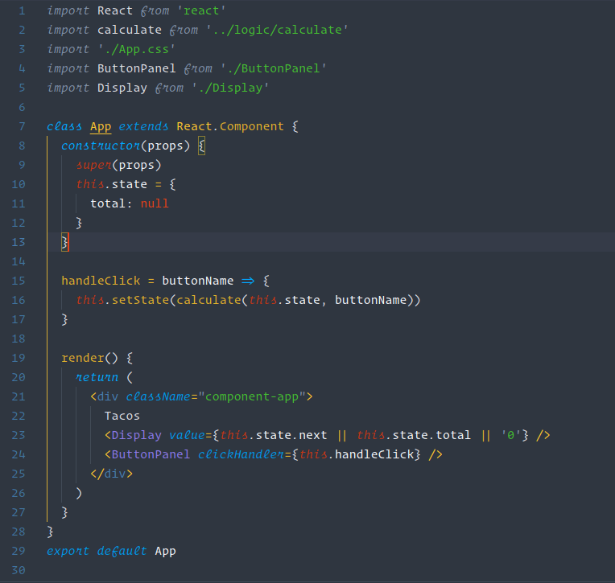

# Understated

A Visual Studio Code theme for the hipsters out there. Open Source and free for every creature.

# Installation

1.  Install [Visual Studio Code](https://code.visualstudio.com/)
2.  Launch Visual Studio Code
3.  Choose **Extensions** from menu
4.  Search for `understated-theme-vscode`
5.  Click **Install** to install it
6.  Click **Reload** to reload the Code
7.  From the menu bar click: Code > Preferences > Color Theme > **Understated**

## Disable Italics

If you wish to disable italics, there is now a no-italic theme available. You will have access to both, select **Understated No Italics** as your color theme.

## Misc

This is my first theme ever, so if you see something amiss, please feel free to [file an issue](https://github.com/hnrchrdl/understated-vscode-theme/issues)! I will happily fix bugs and also accept pull requests.

Thanks to Sarah Drasner, for writing this [blog post about vscode theme creation](https://css-tricks.com/creating-a-vs-code-theme/) and the demos that I copied over from her [Night Owl](https://marketplace.visualstudio.com/items?itemName=sdras.night-owl) theme.

This palette was inspired in part by the British Palette [Theme](https://flatuicolors.com/palette/gb).